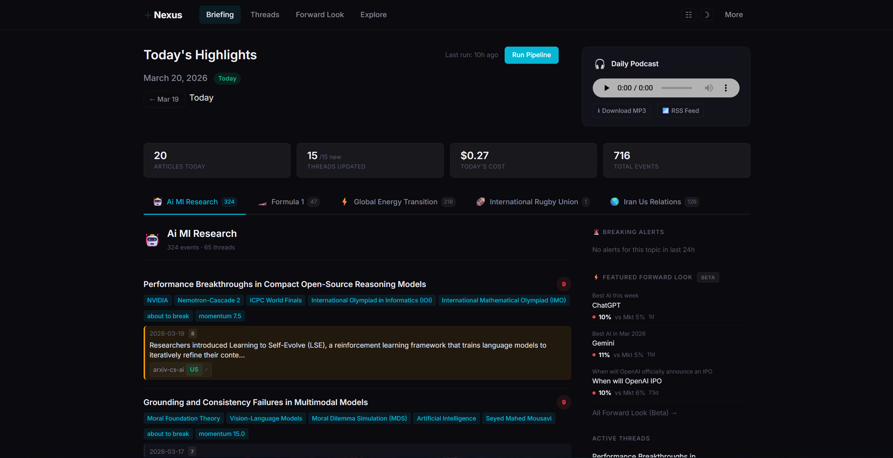
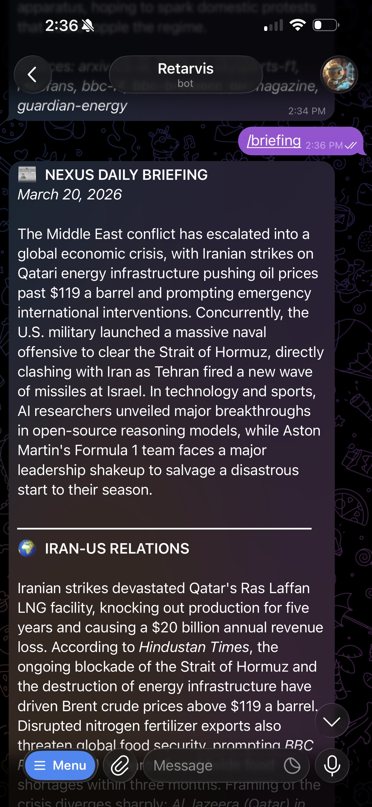
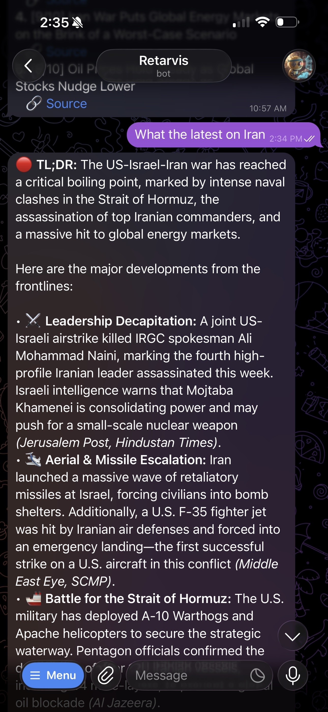

<h1 align="center">
   Nexus
</h1>

<p align="center">
  <strong>Your personal intelligence desk.</strong><br>
  Monitors the news, builds the knowledge graph, writes the briefing, records the podcast. Every morning, before you wake up.<br><br>
  <a href="https://zantryis.github.io/NEXUS/">Docs</a> · <a href="https://zantryis.github.io/NEXUS/pipeline.html">System Map</a> · <a href="#quick-start">Quick Start</a>
</p>

<p align="center">
  
  
</p>

---

Nexus monitors news sources across languages, extracts structured events, builds a persistent knowledge graph, and turns it all into daily briefings, podcast episodes, and probabilistic forecasts. Delivered to your phone or explored through a live dashboard.

You pick the topics. Nexus reads everything, decides what matters, connects the dots, and tells you what changed.

<p align="center">
  
</p>

## What You Get

**Daily briefing + podcast.** A concise intelligence report synthesized from dozens of sources, with a two-host podcast episode generated via TTS. Delivered to Telegram every morning at a time you choose.

**Live dashboard.** Explore topics, narrative threads, entities, events, convergence/divergence signals, source balance, cost tracking, and filter transparency. Everything Nexus knows is browsable.

**Knowledge graph.** Entity resolution across sources and languages. Persistent narrative threads that track how stories evolve over days and weeks. Convergence detection when independent sources confirm the same fact; divergence when they frame it differently.

**Forward Look (Beta).** Actor-based probabilistic forecasts generated from your knowledge graph. Optional Kalshi market comparison when prediction market data is available.

**Breaking news.** Between daily runs, Nexus polls wire feeds and alerts you when something crosses your significance threshold.

**Ask it questions.** Text the Telegram bot a question about any tracked topic. It answers from accumulated knowledge, falling back to web search when needed.

<p align="center">
  
  &nbsp;&nbsp;
  
</p>

## Quick Start

### Docker (recommended)

```bash
git clone https://github.com/zantryis/NEXUS.git
cd NEXUS
docker compose up
```

### Without Docker

Requires Python 3.11+ and [ffmpeg](https://ffmpeg.org/) (for podcast audio).

```bash
git clone https://github.com/zantryis/NEXUS.git
cd NEXUS
pip install -e ".[all]"
python -m nexus run
```

Open **http://localhost:8080** and the setup wizard walks you through everything: provider, API key, topics, timezone, schedule, and optional Telegram. Source discovery, the first pipeline run, historical backfill, and Forward Look generation all happen automatically.

## What You Need

One LLM API key. The wizard helps you choose:

| Preset | Provider | ~Cost/Day |
|--------|----------|-----------|
| `free` | Ollama (local) | $0 |
| `cheap` | DeepSeek | $0.01 |
| `balanced` | Gemini Flash + Pro | $0.05 |
| `quality` | Gemini Pro | $0.15 |
| `openai-cheap` | GPT-5.4 Mini | $0.05 |
| `openai-balanced` | GPT-5.4 Mini + 5.4 | $0.15 |
| `openai-quality` | GPT-5.4 Mini + 5.4 | $0.30 |
| `anthropic` | Claude Sonnet 4.6 | $0.15 |

**Optional:** `TELEGRAM_BOT_TOKEN` for phone delivery ([@BotFather](https://t.me/BotFather)) · `ELEVENLABS_API_KEY` for alternative TTS

## How It Works

20 pipeline stages take raw RSS all the way to briefings, podcasts, and forecasts. Everything persists to a single SQLite file. No external databases, no cloud infrastructure beyond the LLM API. Back up the system by copying one folder.

**[Explore the full System Map →](https://zantryis.github.io/NEXUS/pipeline.html)**

## Demo Mode

No API keys needed. Explore the dashboard with sample data:

```bash
python -m nexus demo seed --from-scratch
python -m nexus demo serve
```

Demo mode is read-only: settings locked, all pages render with seeded data. Good for screenshots and walkthroughs.

## Configuration

### API Keys (`.env`)

| Key | When Needed |
|-----|-------------|
| `GEMINI_API_KEY` | Gemini presets |
| `OPENAI_API_KEY` | OpenAI presets |
| `ANTHROPIC_API_KEY` | Anthropic preset |
| `DEEPSEEK_API_KEY` | DeepSeek preset |
| `TELEGRAM_BOT_TOKEN` | Telegram delivery |
| `ELEVENLABS_API_KEY` | ElevenLabs TTS |
| `NEXUS_ADMIN_TOKEN` | Remote access to `/setup` and `/settings` |

At least one LLM key is required (unless using the `free`/Ollama preset).

### Topics (`data/config.yaml`)

Four topics ship with pre-built source registries: Iran-US Relations, AI/ML Research, Formula 1, and Global Energy Transition. For custom topics, Nexus auto-discovers RSS feeds during setup.

Each topic supports subtopics, source languages, filter thresholds (1-10), scope (narrow/medium/broad), and perspective diversity settings. See `data/config.example.yaml` for the full schema.

### Network & Security

- Binds to `127.0.0.1` by default, only reachable from your machine
- Docker Compose adds a narrow gateway exception for `localhost:8080`
- For remote access: set `NEXUS_ADMIN_TOKEN` and open `http://host:8080/settings?admin_token=YOUR_TOKEN` once
- Setup wizard is disabled after first run unless `NEXUS_ALLOW_SETUP_RESET=1`

### Smoke Mode

Cap ingestion for fast testing:

```bash
NEXUS_SMOKE_MODE=20 python -m nexus run   # 20 articles per topic max
```

## CLI Reference

```bash
python -m nexus run                        # Start all services (dashboard + scheduler + bot)
python -m nexus engine                     # Run pipeline once
python -m nexus serve                      # Dashboard only
python -m nexus setup                      # Interactive CLI setup wizard
python -m nexus sources discover <slug>    # Auto-discover RSS feeds for a topic
python -m nexus sources check              # Test RSS feed health
python -m nexus forecast generate          # Generate Forward Look forecasts
python -m nexus demo seed [--from-scratch] # Seed demo database
python -m nexus demo serve                 # Start demo server
```

Run `python -m nexus --help` for the full command list including benchmark, evaluation, and experiment tooling.

## Forward Look (Beta)

The prediction surface generates calibrated probabilistic forecasts from your knowledge graph using an actor-based reasoning engine. For each question, Nexus identifies relevant actors, reasons about their likely behavior, and synthesizes a probability estimate. Raw outputs are compressed toward 0.5 to correct for LLM overconfidence (gamma=0.8).

When Kalshi prediction market data is available, Nexus generates independent estimates for the same questions and shows the comparison. Useful for spotting where your knowledge graph sees something the market doesn't.

The bigger forecast lab (6 engines, hindcast framework, benchmark suites) ships in-repo but is not part of the default setup or onboarding. See [ARCHITECTURE.md](ARCHITECTURE.md) for details.

## Development

```bash
pip install -e ".[all,dev]"
pytest -m "not e2e and not integration"    # Default test suite (1,558 unit tests)
pytest -m e2e                              # E2E tests (67 tests, requires API keys)
python -m nexus experiment                 # Internal benchmark suites
```

See [ARCHITECTURE.md](ARCHITECTURE.md) for the full module map, schema details, and contributor reference.

## Author

Built by [@zantryis](https://github.com/zantryis)

## License

[MIT](LICENSE)
